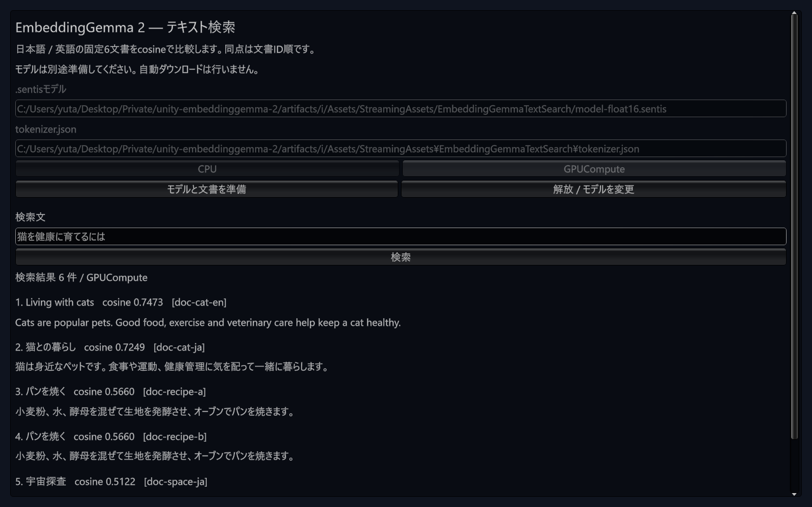
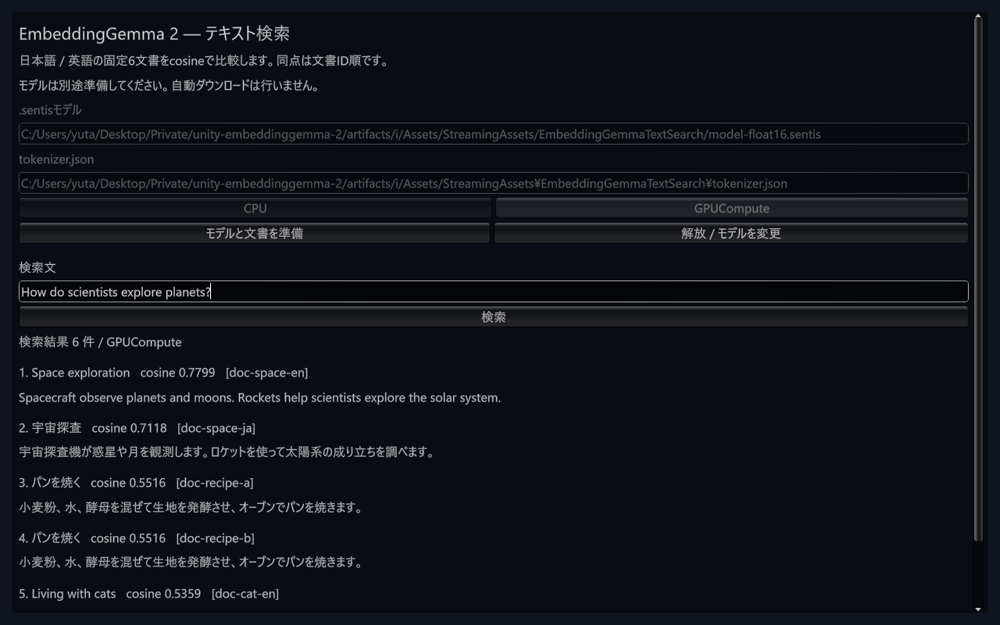

# Windows Editorのsample font寿命の修正

確認日: 2026-10-10。実行sourceは `f7ffbfd4478efb33da546f742ec59ba06e3e1d61`。
Unity 6000.3.16f1 / Sentis 2.6.1 / uloop-cli 3.8.1、Windows / Direct3D12 / RTX 4070 Ti SUPER。
[結果JSON](results/m2-editor-font-lifetime-windows-20261010.json)に失敗・合格・実際のbackendと固定参照の照合を保存した。
既存のGit consumer `artifacts/i` のimport済みsampleへ一致する作業ソースを配置した結果であり、この修正SHAを新しいGit URLで解決した結果ではない。

## 原因と変更

修正前、実際のIMGUIが生成font `-3220` を `UnityEditor.EditorTextSettings` に登録したことを読み取りで確認した。
Play停止後も同じIDへの参照があり、native Fontは破棄済みだった。
これはsampleのviewが破棄するfontと、Play / domain reloadをまたぐEditorのfont cacheの寿命が一致しない経路である。

Unityの[IMGUITextHandle](https://raw.githubusercontent.com/Unity-Technologies/UnityCsReference/6000.3/Modules/IMGUI/IMGUITextHandle.cs)はfontをTextSettingsのcacheへ渡し、[TextSettings](https://raw.githubusercontent.com/Unity-Technologies/UnityCsReference/6000.3/Modules/TextCoreTextEngine/Managed/TextAssets/TextSettings.cs)は破棄されたfont参照を検出すると警告する。参照コードは6000.3ブランチであり、上のnative instance観測は実際の6000.3.16f1で行った。

`TextSearchGuiFont` がEditor内で1つのfontを所有するように変更した。`HideAndDontSave` と `SessionState` のinstance IDでdomain reload後も同じnative fontを見つけ、view破棄では解放しない。Editor終了callbackで所有fontを破棄する。OS font family名は変更しない。
Player側はviewごとに生成し、元と同じくview破棄時に解放する条件分岐を維持した。
本番処理はUnityのprivate cacheへ変更を加えず、警告を無効化しない。private fieldを読む処理は固定Editorに対する検証テストだけに置いた。Core Runtimeの差分は0。

保存済みscene / Play停止 / TestRunner非稼働を確認した後、同じEditor PID `139424` を正常終了した。終了callbackの後に観測用callbackで `original_id=-4736 destroyed=True remaining_owned_id=0` を記録し、所有fontのnative破棄とSessionState消去を確認した。Editor.logの `Shut down.` とEditor本体0件も確認した。強制終了による結果ではない。

## TDDと回帰

| 実行 | 結果 | 証拠と意味 |
| --- | --- | --- |
| 修正前の2件 | 0 passed / 2 failed | 実IMGUIの複数viewが別fontを作ることと、Play停止後にcacheへ破棄fontが残ることを意図したassertionで再現 |
| 最初の実装 | 1 passed / 1 failed | font名を識別用に変更するとOS family lookupが失敗し、IMGUI登録assertionに失敗。採用せず、実験用fontも削除 |
| family名を維持した修正 | 2 passed / 0 failed / 0 skipped | 実際の2回のEnter / Exit Playとdomain reloadをまたいで同じnative fontを再利用し、cache参照が有効 |
| sample EditMode全体 | 66 passed / 0 failed / 0 skipped | 上記2件を含む回帰 |
| sample PlayMode | 2 passed / 0 failed / 0 skipped / 0 inconclusive | compile成功後、CLIも完了応答を受信 |
| uv package audit | success、errors 0 | 配布構造・GUID・依存の監査 |

Enter / Exit Playを含むEditMode実行は、CLIで受理後に `UNITY_DISCONNECTED_AFTER_ACCEPT` / `SafeToRetry=false` が返った。再送せず、同じ実行のUnity保存NUnit XMLを回収し、対象test名・開始終了時刻・件数を確認した。次のtest開始前にTestRunnerの非稼働も確認した。CLI接続失敗をtest失敗や完了の代用にしていない。

## Playと実GPUの画面確認

モデル未準備のsample UIでPlay開始・停止を3回実行した。すべてfont ID `-4736` を再利用し、停止前後のConsoleは0件だった。

Float16モデルを準備し、requested / actualとも `GPUCompute`、実際の `EmbeddingGemma.TextEmbedder` / Sentis Workerを確認した。
Game Viewの実mouse / keyboard入力で日本語・英語queryを検索し、固定6文書の全順位とscoreをPython参照へ機械照合した。参照SHA-256は `3530756b36316a812ac853f0722bed5479e92e6bb02ca6aa41c06660d32a71ec`。

| query | 全6順位 | 最大score絶対誤差 |
| --- | --- | --- |
| 猫を健康に育てるには | 一致 | 6.8903e-8 |
| How do scientists explore planets? | 一致 | 1.0257e-7 |

最初のBackspaceイベントは入力を空にできず、英語queryが残った。その試行は空入力合格に含めない。
再確認では `Event.KeyboardEvent("^a")` と `Event.KeyboardEvent("backspace")` で実入力を空にできたことを先に観測し、Searchボタンで `Query text is required` を表示、結果0件を確認した。
実Releaseボタン後はready=false / Workerなし / 結果0件、Play停止前後のConsoleは0件。元の保存scene、dirty=false、Game Viewの最大化解除を復元した。

日本語と英語の両方の実画面を目視した。日本語本文・見出し・queryは表示され、表示範囲の縦欠けはなかった。これは下の1280×800のWindows Game Viewでの確認範囲である。

## 未検証と残る問題

- `Font.GetCharacterInfo` の旧glyph probeは日本語でfalseだった。これをglyph検証合格に数えず、実TextCore画面の観察と分けて記録した。
- Editor終了時の所有font破棄は確認済み。Player側の新helperはbuild / 実行未確認。
- 以前のFound native allocation診断の責任箇所は未確定。この条件でConsole 0件でも、native leak全体の解消やdomain reloadの高速化は証明しない。
- 正常終了のnative `MemoryLeaks` 診断はallocatedMemory=17,476,385 bytesを報告した。fontの破棄とは別の観測値で、責任箇所や有害なリークの量を確定しない。
- 成功した準備中にEditor.logへD3D12 upload buffer size診断が出た。原因解消や性能改善は主張しない。
- 日英2queryのFloat16 GPU操作は、既存のFP32 / Float16 × CPU / GPU全4条件の精度結果を置き換えない。
- 新固定Git consumer、macOS / iOS / Android実機、候補 / tag導入と正式Releaseは後続gate。`0.1.0-pre.1` は未リリース。
