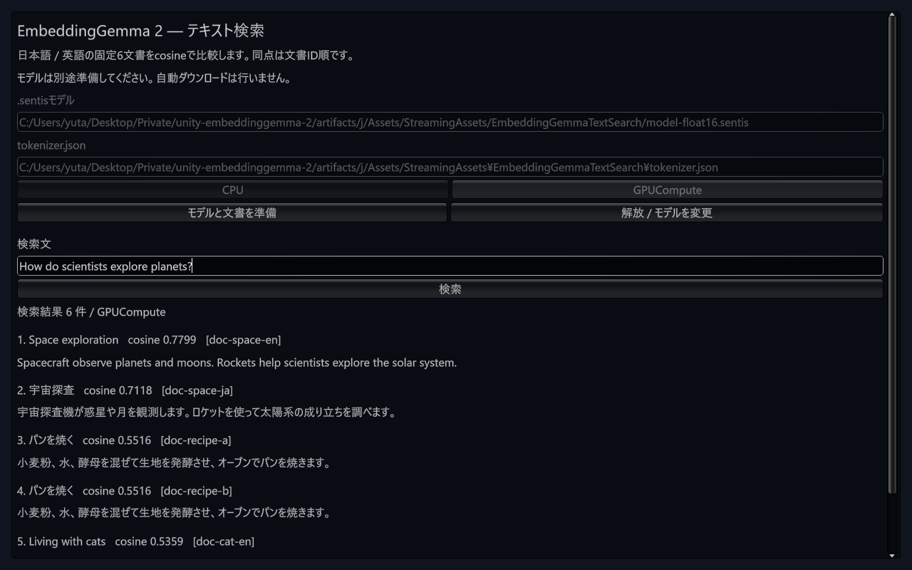

# font修正後の固定Git導入と測定fixtureの寿命

2026-10-10。PR #29統合main `fc66af7bc9150ddcf759917a5e9c92b2c5afa991`を新しい空のconsumer `artifacts/j`へ固定Git URLで導入した。
[結果JSON](results/m2-font-git-consumer-windows-20261010.json)は、最初のGit導入・実モデル結果と、その後のEditorテスト2ファイルだけの修正を分けて記録する。
PR #29のhead `996827b`の[CI run 38029721944](https://github.com/ayutaz/unity-embeddinggemma-2/actions/runs/38029721944)と、統合mainの[CI run 38029860876](https://github.com/ayutaz/unity-embeddinggemma-2/actions/runs/38029860876)は全8 job成功した。

## 新規Git consumer

既存Editor PID 139424の正常終了とEditor本体0件を確認してから、既存uvハーネスで新Editorを1回だけ起動した。PID 105536、Unity 6000.3.16f1 / Sentis 2.6.1 / Windows Standalone target / Direct3D12 / RTX 4070 Ti SUPER。
`ALLUSERSPROFILE=C:\ProgramData`を確認した。初期Libraryはなく、Unity同梱Default.wltを使用し、既存のUPM download cacheと監査済みモデル・参照をhardlinkで再利用した。新しいdownload / 変換 / 元.pt2 importは行っていない。

requested / resolved SHAとsource=gitが一致した。配布92ファイルと配置済みsample 52ファイルを固定main・実際のGit解決UPMと照合した。package.jsonはUPMが追加する `_fingerprint` だけを除いた全内容、他はLF正規化SHA-256で一致。FP32 / Float16 / tokenizerの3ファイルも完全hashと長さを照合した。
起動からcompile・ログ取得まで約95.6秒の単回測定。cold machineの起動性能やdomain reloadの改善を証明する値ではない。

| 固定mainでの実行 | 結果 |
| --- | --- |
| compile | Error 0 / Warning 0 |
| UPM契約 | 38 passed |
| sample EditMode | 66 passed / 0 failed / 0 skipped / 0 inconclusive |
| sample PlayMode | 2 passed / 0 failed / 0 skipped / 0 inconclusive |
| tokenizer | 1 passed、固定15入力のID / mask一致 |
| 実モデル検索 | FP32 / Float16 × CPU / GPUCompute、4 passed / 0 failed / 0 skipped / 0 inconclusive |

EditModeのPlay / reload中にCLIは受理後EOFを返した。テストを再送せず、同じ実行のUnity保存NUnit XMLの名称・時刻・件数とTestRunner非稼働を確認した。最初の読み取りobserverもreload中に接続を失い、raw artifactを保存できなかったことをJSONへ明記した。そのobserverを完了証拠には使わない。

## 実モデル・画面・cache

固定6文書 / 4queryの全順位とscore、埋め込みが各条件で参照に一致した。最小cosineはFP32 CPU=0.9999999999981735、FP32 GPU=0.9999999999995120、Float16 CPU=0.9999999999982625、Float16 GPU=0.9999999999994984。
CoreのWorker生成時にrequested backendと `worker.backendType` の一致を必須にし、GPU代替やskipは使わない。画面では実際のWorkerを読み取り、GPUComputeを確認した。

実mouse / keyboard操作で日英queryの全6順位・score、空入力拒否、Release・Play停止を確認した。モデル欠落では準備エラーを表示し、Workerを生成しない。共有font ID `-43108`を継続して使用した。

最初の画面操作は通常のローカルパスで、再準備も直接読み込みだった。これをcache再利用とは数えない。続いて実file URLを指定して別に測定した。

| file URL条件 | 転送数 | 完全CNG監査 | stage時間 |
| --- | ---: | ---: | ---: |
| 初回 | receipt + Float16 + tokenizerの3ファイル | 413.0494 ms | 904.9000 ms |
| warm | receipt 1ファイル、モデル再転送0 | 426.9409 ms | 441.2914 ms |

準備直後の最初の観測はpreparing=trueだったため、terminalとして扱わず、同じ受理済み準備を読み取りで追跡した。warmも同じ方式で完了を確認した。
成功後はactive 1組 / payload 3ファイル / 585,947,193 bytes。pending / previous / incomingはなく、Release後に `.lock` を排他・読み取りで開けることを確認した。stage時間は単回で、model deserialize / Worker生成 / 文書推論を含まない。Editor-wide memoryと未測定のGPU memoryを区別する。

1280×800の画面を目視し、英語queryと日英の見出し・文書本文が読めることを確認した。

## 測定fixtureが残す破棄済みfontと修正

最初のUI sessionは停止前後にError 1 / Warning 1があり、元のstackを保持した。Warningはinvalid font reference、Errorは `UnityEditor.Search.SearchDatabase.EnumerateAll` / `SearchInit.IndexationOnStartup` の `ArgumentOutOfRangeException`。UI・精度テスト合格をConsole 0へ読み替えない。

sample本体の共有fontは有効だった。既存 `TextSearchGuiStylesTests` のSetup → 実 `GUIStyle.CalcHeight` 測定 → Cleanupを実行すると、font ID `-44496`がEditor cacheへ登録され、fixture終了で破棄されたまま参照が残ることを直接確認した。

修正source `bc3ac490da7738db8ac9bdff872836fac0684834`ではEditor test 2ファイルだけを変更した。sample本体 / font helper / Core Runtimeは固定mainと同一。実行はimport済みEditorテストへの作業ソース配置で、この修正SHAの新Git解決とは扱わない。

| TDD | 結果 |
| --- | --- |
| 実測定後、fixture Cleanupでもcache fontが有効であるテスト | 意図した1 failed。破棄済みfontへの参照をassertionで検出 |
| 最初の共有font案 | 1 failed。保持済みfontの旧 `GetCharacterInfo` がglyphを返さず、元の境界assertionに失敗 |
| 修正版 | 1 passed。GUIStyleへEditor共有fontを渡し、同じOS familyの新しい一時fontで旧glyph境界を測定。一時fontはGUIStyleへ渡さず測定後に破棄 |
| sample全体 | 67 passed / 0 failed / 0 skipped / 0 inconclusive。受理後EOFは同じ実行の保存XMLで回収 |

元のglyph境界・行高assertionは維持した。測定後の共有font / fontAssetは有効で、Editor cacheのinvalid referenceは0件。
モデル未準備UIのPlay開始・停止を3回実行し、同じfont IDを使い、3回とも停止前後のConsoleは0件だった。最終状態はPlay停止・compile停止・sample scene clean、標準Game View layoutとNativeLeakDetection=Enabledへ復元済み。Asset Import WorkerをEditor本体と区別し、GUI Editorは同じ1つだけ。

## 残るgate

検索DBエラーは後続3回で再現しなかったが、原因・解消は未確定。既存のnative allocation診断、Player sample画面、新helperのPlayer実行、macOS / iOS / Androidの実CPU / GPU、候補 / tag固定導入と正式Releaseは未完了。
今回のconsumerは元.pt2のimportやM1全15ケースのembeddingを再実行せず、token15と実検索4条件を検証した。既存M1実測を置き換えない。
GitHub APIでRepository Secrets / self-hosted runnerは引き続き0件。`0.1.0-pre.1`は未リリース。
