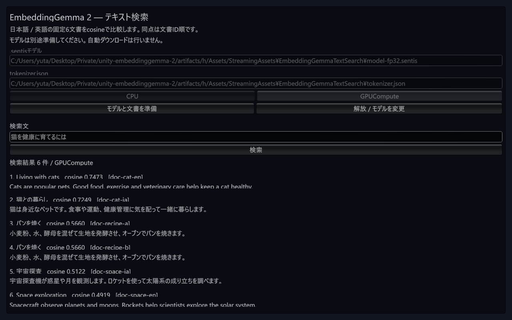
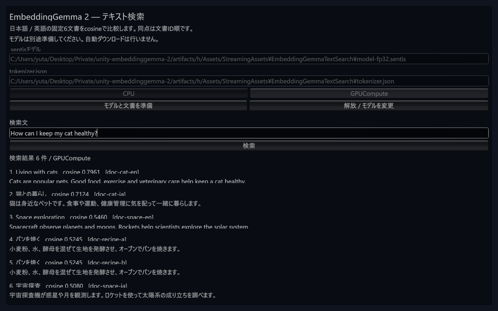

# commit固定Git URL consumerの実動作確認

2026-10-10。Windows Editor / Unity 6000.3.16f1 / Sentis 2.6.1 / RTX 4070 Ti SUPER / Direct3D12で確認した。[機械監査した結果](results/m2-git-consumer-runtime-windows-20261010.json)に条件・NUnit・全順位・UI状態を記録する。

## Git導入と初期化

新しい空の `artifacts/h` へ、mainのcommit `e7b3a54ec279f0c78be43a58548ec6695c4ba4ec` を固定して導入した。ローカルfile依存を使わず、Package Managerのrequested URL / resolved hash / Git sourceが完全一致した。Sentis 2.6.1 / Newtonsoft JSON 3.2.2も解決した。

開始時にLibraryはなく、UPM download cacheは共有している。以前のconsumer `artifacts/g` の初期化失敗は[当時の記録](results/m2-git-consumer-windows-20261010.json)に保持した。今回は別のproject pathとGit SHA、Unity同梱の標準layoutを使い、前のEditorの終了をprocessで確認してから1つだけ起動した。

初期化は約82.2秒で完了し、uloop-cli 3.8.1がReady / ServerReady / ProjectIpcReadyを確認した。標準layoutが原因を解消したと断定はしない。複数条件を変えた実行であり、以前の停止原因を分離した比較ではない。

```powershell
# tools/ のuv環境で実行。hは新しい空の出力先。
uv run --locked python -m embeddinggemma_tools.package --consumer ../artifacts/h --git-revision e7b3a54ec279f0c78be43a58548ec6695c4ba4ec --automation --sample
```

今回の標準layout配置は、Unity同梱の `Editor/Data/Resources/Layouts/Default.wlt` を新しいconsumerの `UserSettings/Layouts/default-6000.dwlt` へコピーしたもの。copy元SHA-256を結果に記録した。既存利用者のlayoutを上書きする手順ではない。

## 実Editorで合格した範囲

- UPM契約38件、sample契約28件。compile成功、failed / skipped / inconclusive 0。
- 固定Python参照の15入力で、token ID / attention mask全128要素が完全一致。
- 実モデルFP32 / Float16重み × CPU / GPUComputeの4条件が合格。固定6文書 / 4queryの埋め込みcosine、全順位、score許容差を確認。GPU skip / CPU代替なし。tokenと合わせたNUnit結果は5 passed / failed・skipped・inconclusive 0。
- Game Viewへmouse / keyboardイベントを送り、GPUモデルと6文書の準備、日本語検索、英語入力・検索、空入力の拒否、解放、Play停止を確認。query代入や検索method直呼びでUI操作の代用はしていない。
- Play停止後は検索sceneがclean。Editorを1つだけ残した。

監査済みの既存prepared weights / tokenizer / Python参照を再利用し、配置した3ファイルはcopy後も完全SHA-256が一致した。重みの再download / 再変換と元 `.pt2` のimportは行っていない。15ケースの元M1埋め込みを今回再実行した結果とは区別する。

検証中にPR #18がmain `f44976b71e2c85260d86852ef426011ae011101a` へ統合された。今回の固定SHAとこのmainのUPM全体のGit treeが一致することを確認し、両tree SHAを結果へ記録した。mainへ直接pushしていない。

## 画面と残る問題





画像を実際に確認した。入力・検索・全6順位の表示は動くが、labelと結果本文の一部の文字が縦方向に切れる。fontの実際のmetricsとGUILayoutの高さを合わせる回帰修正を、リリース前の安定化作業に残す。見た目まで完成したUIとは扱わない。

Play停止後のConsoleはPersistent allocation Log 1件 / Warning・Error 0件。stackは空で、発生元は確定していない。既存のfont警告やPlayer終了時memory診断も含め、native allocationが解消済みとはしない。

今回の成功はWindows Editorの機能確認。Windows IL2CPP / release stripping、macOS Editor / iOS / Android実機、正式version / tag導入 / GitHub Releaseは未完了であり、M2全体の完了ではない。
