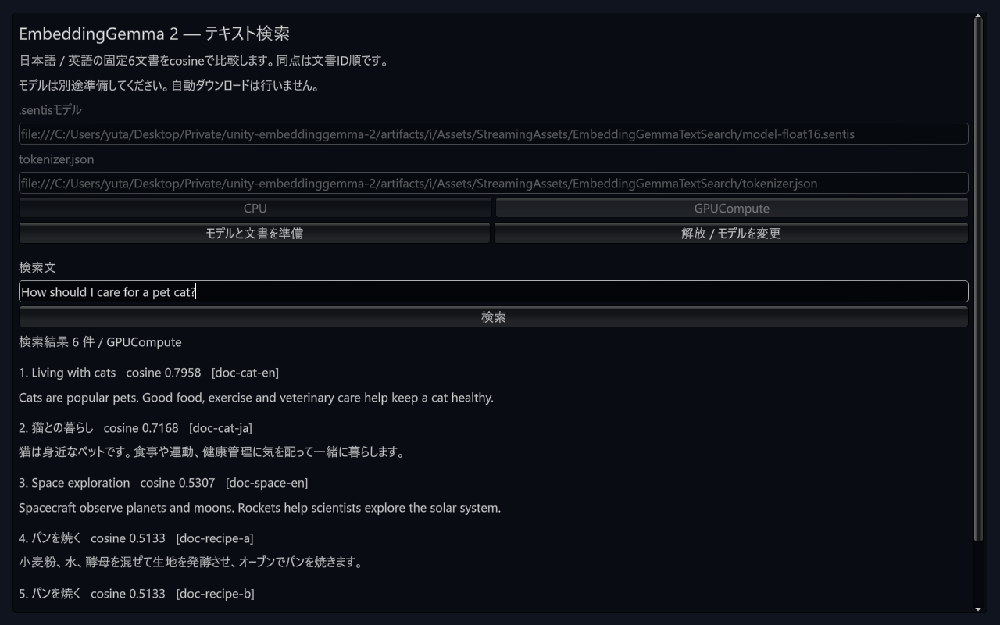

# 最新sampleを含む固定Git consumerの検証

2026-10-10。PR #24統合後main `01f3d8682a97053bf4583e14fd8fbed14e2c8cae`を新しい空のconsumer `artifacts/i`へ導入した。[結果JSON](results/m2-latest-git-consumer-windows-20261010.json)にGit解決、ソース照合、NUnit、CLI失敗と回収結果、実CPU / GPUの全順位・score、UI・ログを記録する。

## 導入とEditor

`tools/`のuvから既存のconsumer作成CLIを`--git-revision <上記40桁SHA> --automation --sample`で実行した。開始時にLibraryはなく、RuntimeはGit URL依存。Package Managerのrequested revision / resolved hash / source=gitが一致し、Sentis 2.6.1、Newtonsoft 3.2.2、builtin UnityWebRequest 1.0.0が解決した。

元の検証EditorはPlay停止・scene cleanを確認して通常終了した。PID 174716の終了とEditor 0件を確認してから、uloopで新Editorを1回だけ起動した。Unity 6000.3.16f1、PID 110956、約101.5秒でReady / ServerReady / ProjectIpcReadyを確認。最終状態も同じEditor 1つだけで、再起動していない。

Unity同梱Default.wltを新consumerのlayoutへ配置し、UPM download cacheと既存の監査済みprepared model / tokenizer / Python参照を再利用した。大きいモデルはhardlinkで配置し、再download / 再変換 / 元.pt2 importを行っていない。fresh Libraryからの導入であり、cold machineや空model cacheからの生成検証ではない。

固定mainと解決されたUPMの88ファイルを照合した。Package Managerはpackage.jsonを整形して`_fingerprint`を追加するため、このファイルはfingerprintだけを除去して全manifest内容を比較し、その他はLF正規化SHA-256を比較した。import済みTextSearch sampleの全ファイルも固定main / 解決UPMと一致した。以前の[既存consumerへのsampleソース配置](m2-sample-cache-validation.md)とは別の証拠である。

## 実Editorの契約と接続失敗

| 対象 | 結果 |
| --- | --- |
| compile | Error 0 / Warning 0 |
| UPM契約 | 38 passed |
| sample EditMode | 64 passed |
| sample PlayMode | 2 passed。受理済み実行のUnity保存XMLから回収 |
| tokenizer | 1 passed、固定15入力のtoken ID / mask完全一致 |
| 実モデル検索 | FP32 / Float16重み × CPU / GPUComputeの4 passed |

各テストのfailed / skipped / inconclusiveは0。PlayModeのCLIは受理後に`UNITY_DISCONNECTED_AFTER_ACCEPT` / EOFとなり、完了応答を受け取れなかった。この接続失敗を保持し、同じEditorを調べた。完了時刻03:57:17 UTCのlast-run recordとUnity保存TestResults.xmlで、対象2テストの名称・時刻・2 passed / 0 failedを照合した。Playはscript-compilationで停止し、コンパイルも終了していた。テスト再実行やEditor再起動はせず、保存XMLのhashを記録した。CLI自体の成功には読み替えない。

## 実モデルと画面

Windows 11 / RTX 4070 Ti SUPER / Direct3D12、固定モデルrevision `914f7f89142e33e77833254d9c9b90c3cef7303b`、batch 1 / length 128 / 768次元。同じ独立Python参照の6文書 / 4queryを使い、全条件で埋め込み・全順位・score・provider解放が合格した。GPU skip / CPU代替はない。

| 条件 | 最小cosine | 最大score差 |
| --- | ---: | ---: |
| FP32 CPU | 0.9999999999981735 | 2.4214e-7 |
| FP32 GPUCompute | 0.9999999999995120 | 9.1862e-8 |
| Float16 CPU | 0.9999999999982625 | 2.1365e-7 |
| Float16 GPUCompute | 0.9999999999994984 | 1.0257e-7 |

このconsumerでは元.pt2のSentis importと元M1全15入力のembeddingを再実行していない。token15入力と検索4条件の新しい結果を、過去のM1や[Windows IL2CPPの全条件](m2-player-il2cpp-validation.md)と分けて扱う。

Game Viewへmouse / keyboardイベントを送り、Float16 file URLとactual TextEmbedder / GPUComputeで準備、固定日本語query、固定英語`How should I care for a pet cat?`の入力・検索、空入力拒否、解放、再準備、再解放を確認した。日英とも全6順位・scoreがPython参照と一致した。

初回はreceipt + Float16 + tokenizerの3ファイルを転送し、完全CNG監査433.598ms / stage 924.8086ms。warmはmanifest 1件だけ、モデル再転送0、完全監査430.2749ms / stage 444.7355ms。保持はactive 1組 / 3ファイル / 585,947,193 bytes。時間は単回で、model deserialize / worker作成 / 文書埋め込みを含まず、統計的・cold条件の高速化を証明しない。

画像を確認し、固定英語queryと日英の結果本文が読めることを確認した。後続行はスクロールで表示する。最終状態はPlay停止・compile停止・検索scene clean・workerとlease解放済み。

## 残るgate

Play停止後のConsoleはError 0 / Warning 0、Persistent allocation Log 1件、stackなしだった。font WarningはこのUI sessionでは出なかったが、過去に発生した警告の原因特定や解消の証拠にはしない。allocationログの原因は未確定。

固定mainの新規Git導入というgateは今回のWindows条件で確認できた。正式tag固定導入、macOS Editor / iOS / Androidの実モデルCPU / GPU、実APK、sample Player画面、任意consumerのstrippingと残る安定性は未完了。[4段階の計画](m2-release-plan.md)に従って進め、Windows合格だけでM2全体や正式Releaseを完了とはしない。

モデル・cache・Library・binaryはGit管理外。小さい結果JSONと画面画像のみをコミットした。
