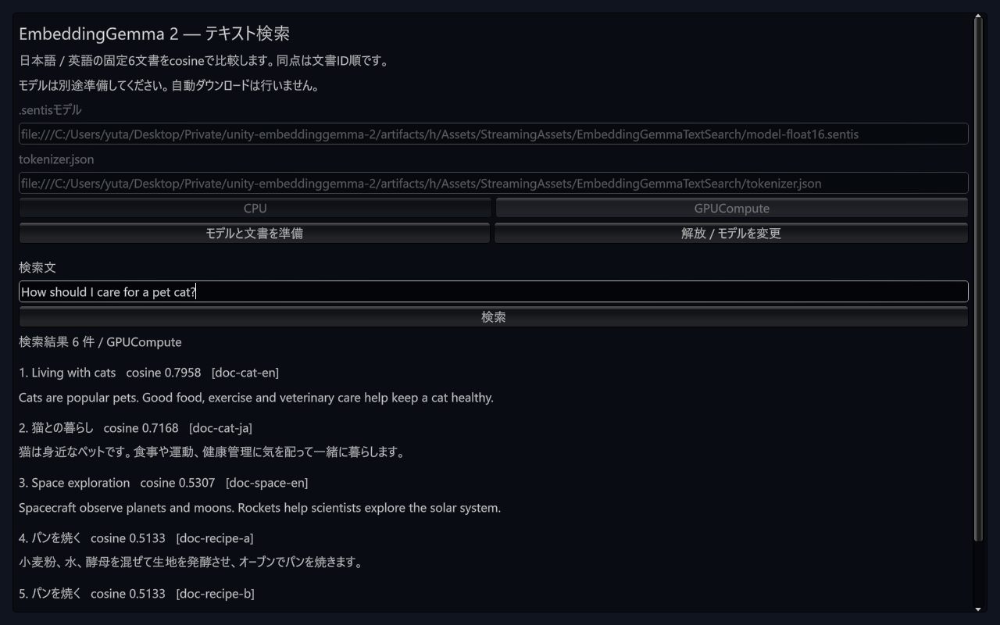
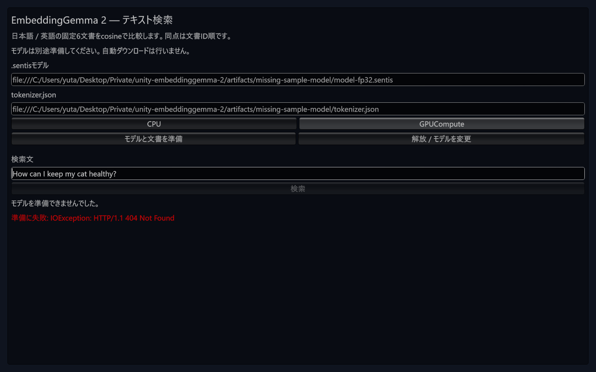

# TextSearch sample: 選択モデルの配置・cache検証

確認日: 2026-10-10。実行ソースは `2e463a844f10ce84548c7d7f9339ae2c2aa6e068`、base mainはPR #23後の `197fae9f063300f669a99f83f9779be89f07e3ab`。
[機械照合した結果](results/m2-sample-cache-windows-20261010.json)に、テストのred / green、実GPUの状態・全順位・score・hash backend、失敗、ログ、ソースhashを保持した。

## 変更と配置条件

配布UPMのTextSearch sampleに、ローカル`file://`とAndroid StreamingAssetsの`jar:file://...!/assets/...`を所有cacheへ展開する経路を追加した。既存のfilesystemパスは同期ロードを維持する。Core Runtimeは変更していない。

- 必要なのは準備済み`preparation.json`、選択した`model-fp32.sentis`または`model-float16.sentis`、同じdirectoryの`tokenizer.json`。remote URLは対象外。
- receiptは成功、実行Unity version、生成元commitと元モデルSHA-256の固定形式、固定3ファイルの長さ・hashを要求する。重複propertyや不正なdescriptorを拒否する。receiptの署名検証ではないため、モデル取得元の監査は[モデル準備手順](model-preparation.md)で別途行う。
- 選択した重みとtokenizerだけをコピーし、完全SHA-256照合後に推論器を作る。同一receipt・同じ選択の再準備も完全hashを毎回照合し、転送はmanifest 1件だけになる。
- `persistentDataPath/EmbeddingGemmaTextSearch/ModelCache`はowner markerと排他lockで管理する。成功後は1組、更新中は旧activeと候補を保持し、未知のfile / directory / linkは削除せず拒否する。固定の既知ファイルだけを削除し、再帰削除は使わない。
- 失敗時は旧activeを残す。中断した候補は次の試行で破棄し、途中までのbyte-range転送再開はしない。publication途中のprevious / activeを回復する契約も確認した。
- cacheのleaseはworker使用中に保持し、解放・無効化・Play停止ではworkerを先にdisposeしてから閉じる。転送中の解放は所有するenumerator / requestをdisposeし、後からworkerを作らない。

Windows Runtimeの完全hashはOSのCNGを使用し、利用できない場合と他OSは.NET SHA-256へ戻る。追加DLLは配布しない。最小consumerでsampleを使う場合はbuiltin `com.unity.modules.unitywebrequest: 1.0.0`が必要で、consumer作成CLIの`--sample`に追加した。sample assemblyは既存のNewtonsoft依存を使用する。

通信はcoroutineだが、hash・Sentis model deserialize・worker作成・文書埋め込みは同期処理。全準備のフレーム予算や他OSのhash性能を保証する実装ではない。

## TDDと実行結果

| 対象 | 意図したred | 最終green |
| --- | --- | --- |
| 選択cache / audit / 所有 / 失敗 | 14 failed | 下記EditModeに含む |
| 完全stream hash / native失敗fallback | 7 failed | 下記EditModeに含む |
| sample非同期準備 / provider / cancellation | 3 failed | 下記EditModeに含む |
| Play中の準備中断 | 1 failed / 1 passed | 2 passed |
| provider作成失敗 / backend不一致後のStatus | 2 failed / 21 passed | 下記EditModeに含む |
| 最終sample EditMode全体 | 上記の段階別redを保持 | 64 passed、failed / skipped / inconclusive = 0 |
| Python consumer module追加 | 2 failed、20 deselected。必要moduleのKeyError | `uv run --locked --no-sync pytest tests/test_package.py`で22 passed |

jar transport・破損・interruption・容量管理・回復は小さい合成transport / providerも使用する。これを実APKや実モデルGPU合格とは数えない。Unityのimport時にNewtonsoft test参照不足と、Monoにない`Path.TrimEndingDirectorySeparator`でcompileが各1 errorになった。明示precompiled test参照と互換なpath処理へ修正し、これらの偶発的compile失敗は意図したredと分けて保持した。

## Windows実モデルのGame View操作

Unity 6000.3.16f1 / Sentis 2.6.1、Windows 11、RTX 4070 Ti SUPER、Direct3D12。既存のGit consumer `artifacts/h`の同じEditorを再利用し、sampleソースを上記commitへ配置した。元のGit解決SHAは `e7b3a54`で、変更sample SHAの新規Git導入成功とは扱わない。sampleソースとconsumerのLF正規化hash、およびcorpus hashを照合した。

既存の監査済み重みを再利用した。元モデルSHAは `92968480724ef7838cbd7d7b7cfd6a8d6d5105bb937f8a9907e965805a7651c8`、モデル生成元commit `2edb272f17a38c7af210474345c35f391fd6955c`、検索参照生成元commit `13f194266162d2a728b2b2a0da9e9e58ae314ff6`。配置receiptのdescriptorを既存の[Player bundle](player-validation.md)と照合し、実際のcache準備で選択した2ファイルの完全hashを照合した。

uloopのdynamic codeから`EditorGUIUtility.QueueGameViewInputEvent`でIMGUIのmouse / keyboard / scrollイベントを送り、ボタン準備・日英入力・検索・空入力・解放・スクロールを実行した。`simulate-mouse-ui`はEventSystem不足、`simulate-mouse-input`はInputSystem不足で失敗し、model操作は受理されなかった。追加packageは導入せず、成功したEditorイベント経路と分けて記録した。利用中CLIの`execute-menu-item`もUNKNOWN_COMMANDだった。

実providerは`EmbeddingGemma.TextEmbedder`、requested / actual backendはGPUComputeで、CPU代替やfake providerではない。

| 選択 / 状態 | 転送件数 | stage時間 ms | 完全hash監査 ms | hash backend |
| --- | ---: | ---: | ---: | --- |
| FP32初回 | 3 | 2449.2318 | 729.6897 | 選択重みとtokenizerの両方CNG |
| FP32再準備 | 1 | 817.8029 | 803.0711 | 同上 |
| Float16へ変更 | 3 | 1549.7348 | 406.0362 | 同上 |
| Float16再準備 | 1 | 458.8436 | 417.9799 | 同上 |

各時間は単回観測。**stage時計は転送・hash・cache操作までで、後続のmodel deserialize / worker作成 / 文書埋め込みを含まない。** 同じEditor、filesystem・shader・import cacheを再利用しており、cold起動、統計比較、peakメモリ、全準備時間の改善を示す測定ではない。

| 固定Python query | 選択重み / actual backend | 6件の全順位 | 最大score差 |
| --- | --- | --- | ---: |
| `猫を健康に育てるには` / query-cat-ja | FP32 / GPUCompute | 一致 | 8.6376e-8 |
| `How should I care for a pet cat?` / query-cat-en | Float16 / GPUCompute | 一致 | 2.1854e-8 |

最初の英語UI操作は`How can I keep my cat healthy?`で、固定Python queryとは異なった。この入力のFP32 / Float16全順位・scoreを別の追加UI結果として保持し、Python一致とは表現しない。cacheを再利用して固定参照と同じ英語queryを追加実行した。今回は固定2queryのUI照合であり、全4query・全CPU / GPU条件の新たな完了証拠ではない。従来の全条件結果は[Windows IL2CPP実測](m2-player-il2cpp-validation.md)等を参照。

空入力は結果0件とエラー表示、明示解放はprovider / stageなしを確認した。使用中のcache lockを別のFileStreamで排他openできず、Play停止後はopenできた。欠落したfile URLの準備はUnityWebRequestの404失敗として表示され、workerは作られなかった。ネットワーク取得の失敗ではない。失敗後も旧Float16 cacheを保持し、directoryはactiveだけ、receipt + Float16 + tokenizerの3件、計585,947,193 bytesだった。旧FP32は残っていない。

最終状態はPlay停止、元scene、dirty=false、Console Error 0。`Deleting invalid font reference.` Warning 1件が残り、stackは`UnityEditor.ScriptReloadProperties:Load`。発生元は未確定で、警告解消・native leak解消とは扱わない。

## 次のgate

1. 統合したsampleを含む固定Git SHAから、空consumerへ新規導入し、module・compile・sample・画面と実モデルを確認する。
2. Android APK build / 配置 / 実jar読み込み・実機CPU / GPUを確認する。今回のfile URLと合成jar契約を代用にしない。
3. macOS Editor / iOS / Androidの実測、任意consumerのstripping、frame latency、安定性の未解決項目を確認する。
4. [4段階の詳細計画](m2-release-plan.md)の全gateを満たす候補でtag固定導入と正式Releaseを行う。

今回の新sample CPU、standalone Playerのsample画面、実APK / 端末、macOS / iOSは未実行。モデル・cache・binary・大きいraw artifactはGitに含めない。小さい結果JSONと画面画像だけを保持した。
