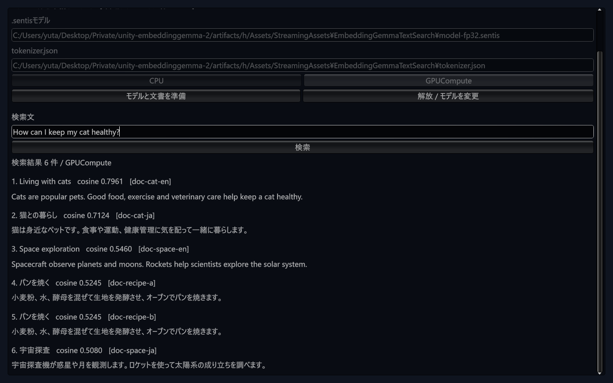
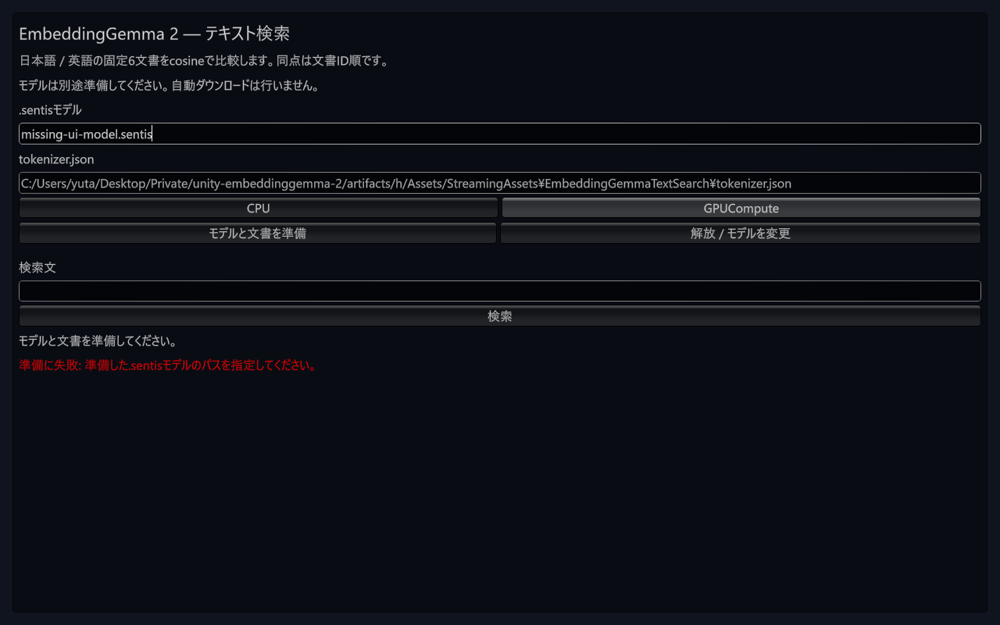

# テキスト検索サンプルの文字欠け修正

Windows Editorの検索画面で、label・入力欄・button・結果本文の文字が縦方向に欠けていた。実際のOS fontを描画する一方で、font未指定のGUIStyleが別のfontで高さを計算する状態を、実glyph境界とGUILayoutの計算値で再現した。

修正はサンプル内に限定する。fontとfontSizeを明示したGUIStyleを初回OnGUIで作って再利用し、本文は折り返す。共有GUISkinを書き換えず、破棄時はstyleのfont参照を外してからサンプル所有のfontを破棄する。推論Runtimeは変更しない。

## TDDと実Editor結果

検証ソースcommitは `1c264badc383d83421d4021de484126d31b240ea`。[数値・ソースhash・操作・ログの記録](results/m2-ui-font-windows-20261010.json)を参照。

- 実fontのglyph境界を使う新規6件で、修正前は意図した5 failed / 1 passed。bodyの計算高さ14.53に対し必要高さ20、headingは26.63に対し27、2行本文は30.49に対し40だった。
- 修正後は既存契約を含むEditMode 34 passed、既存PlayModeライフサイクル1 passed。failed / skipped / inconclusiveは各0。各runのcompileも成功した。
- Windows 11 / Unity 6000.3.16f1 / Sentis 2.6.1 / RTX 4070 Ti SUPER / Direct3D12、Game View 1280 × 800で実際のmouse・keyboard・scroll入力を送った。
- 監査済みFP32モデルをGPUComputeで準備し、日本語・英語検索の6件の全順位とscoreが修正前の[Git consumer実測](m2-git-consumer-runtime-validation.md)と完全一致した。空検索の拒否、解放、存在しないモデルパスでのエラー表示も確認した。
- glyphの縦方向の欠けが解消された画面を確認し、スクロールで6件すべてを表示した。Play停止後、sceneは変更なし。UI実行後のConsoleは0件だった。

## 検証範囲と残る条件

consumerのcore packageは以前のGit commit `e7b3a54ec279f0c78be43a58548ec6695c4ba4ec` のままで、import済みサンプルを今回の作業ブランチのソースへ置き換えた。4つのソースとmetadataの一致を確認した。この結果を、今回の修正commitを新規Git導入した成功としては扱わない。リリース候補では配布差分に応じたGit導入確認を行う。

Windowsのfont・解像度に限定した表示検証であり、他OS・DPI倍率・Player UIは未検証。GUIStyleの再利用は行ったが、GC allocation・frame timeの改善は未測定。推論coreが不変のため今回のUI修正では4条件の実モデル検証を再実行せず、実GPU FP32の日英画面操作と修正前の全順位・score照合を行った。

UI開始前に既存Warning 1件をmessage未取得のままクリアしていたため、由来は未確定として記録した。今回のUI実行後にログが0件でも、以前のPersistent allocation Logやfont警告が修正された証拠にはしない。後続のライフサイクルテストにはTest Runnerの通常Log 2件があった。domain reloadの原因、allocationの切り分け、Windows IL2CPP / release stripping、macOS Editor / iOS / Android、正式リリースのgateは残る。
